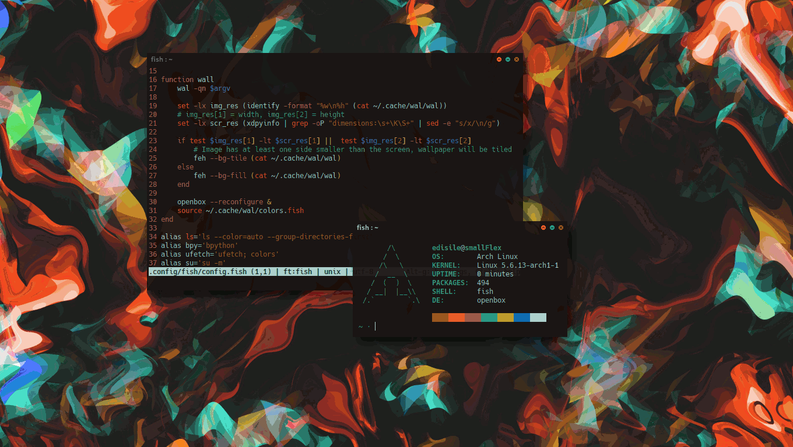

# Walbox
## An Openbox theme fueled by Pywal



Walbox is an Openbox theme that uses Pywal-generated color schemes to adapt itself to the current wallpaper.

### How to install

#### Requirements

You need to have Pywal installed (obviously).

#### Install

```sh
git clone https://github.com/edisile/walbox.git
cd walbox
./install.sh
```

### Usage

Once installed, the theme can be activated by either choosing it in Obconf or by manually editing che rc.xml Openbox config.

When changing the color scheme via Pywal the theme files will be automatically updated, but Openbox won't load the changes; to overcome this you will have to run `openbox --reconfigure`.